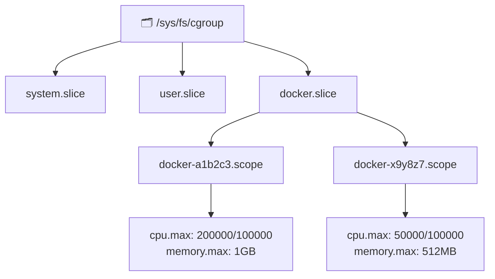

# Linux cgroups and Container Resource Control

While **namespaces** determine what a container can *see*, **cgroups (control groups)** determine how much resources a container can *use*.

## What are Control Groups (cgroups)?

Control Groups are a Linux kernel feature that limits, accounts for, and isolates resource usage (CPU, memory, disk I/O, network) of process collections. Container engines like Docker and containerd use cgroups to enforce flags like `--cpus="2.0"` or `--memory="512m"`.

## cgroups v1 vs cgroups v2 Unified Hierarchy

Legacy cgroups v1 used orthogonal hierarchies per resource controller (cpu, memory, blkio). Modern Linux distributions default to **cgroups v2**, which features a single unified hierarchy tree managed by `systemd`.



## CPU Bandwidth Allocation & CFS Scheduler

The Linux kernel Completely Fair Scheduler (CFS) controls CPU time using a period/quota mechanism:

- `cpu.cfs_period_us`: The period window (default 100,000 µs / 100 ms).
- `cpu.cfs_quota_us`: The quota allocated per period (e.g., 200,000 µs for 2 CPU cores).

### CFS Quota Formula

$$\text{Effective Cores} = \frac{\text{quota}}{\text{period}} = \frac{200,000\,\mu\text{s}}{100,000\,\mu\text{s}} = 2.0\,\text{Cores}$$

When a container exceeds its quota within a single period, the kernel throttles its execution until the next period begins.

$$\text{Throttled Time Ratio} = \max\left(0, 1 - \frac{\text{CPU Quota}}{\text{CPU Demand}}\right)$$

## Memory Limits and OOM Control

Memory limits are configured via `memory.max` and `memory.high` in cgroups v2. When a container exceeds its `memory.max` threshold and memory reclaiming fails, the Linux kernel Out-Of-Memory (OOM) Killer targets the process:

```bash
# Inspecting cgroup v2 memory configuration
cat /sys/fs/cgroup/docker.slice/docker-a1b2c3.scope/memory.max
# Output: 1073741824 (1 GB in bytes)

# Checking current memory consumption
cat /sys/fs/cgroup/docker.slice/docker-a1b2c3.scope/memory.current
# Output: 524288000 (500 MB in bytes)
```

## Hands-On: Configuring cgroup Limits via sysfs

Below is a Python script demonstrating how container runtimes manipulate cgroup v2 sysfs nodes directly:

```python
import os
import sys

def apply_cgroup_limits(cgroup_path: str, cpu_cores: float, memory_mb: int):
    os.makedirs(cgroup_path, exist_ok=True)
    
    # Calculate CFS quota for requested CPU cores (period = 100000us)
    period = 100000
    quota = int(cpu_cores * period)
    
    # Write CPU limit: "quota period"
    with open(os.path.join(cgroup_path, "cpu.max"), "w") as f:
        f.write(f"{quota} {period}\n")
        
    # Write Memory limit in bytes
    memory_bytes = memory_mb * 1024 * 1024
    with open(os.path.join(cgroup_path, "memory.max"), "w") as f:
        f.write(f"{memory_bytes}\n")
        
    # Attach current process to this cgroup
    with open(os.path.join(cgroup_path, "cgroup.procs"), "w") as f:
        f.write(f"{os.getpid()}\n")
        
    print(f"Process {os.getpid()} bound to cgroup {cgroup_path} with {cpu_cores} CPUs & {memory_mb}MB RAM.")

if __name__ == "__main__":
    apply_cgroup_limits("/sys/fs/cgroup/my_custom_container", cpu_cores=1.5, memory_mb=512)
```

## Summary

Understanding cgroups is critical for sizing Kubernetes resource requests/limits (`resources.limits.cpu`), preventing node-level noisy neighbor issues, and debugging application latency spikes caused by CPU throttling.
