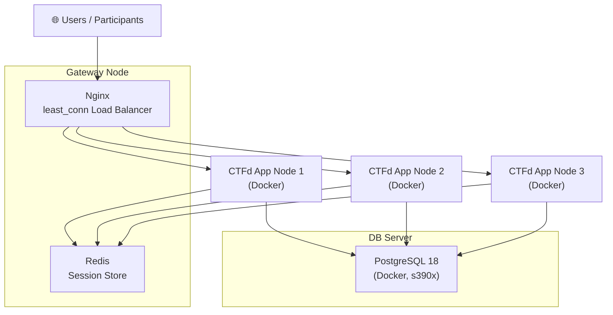
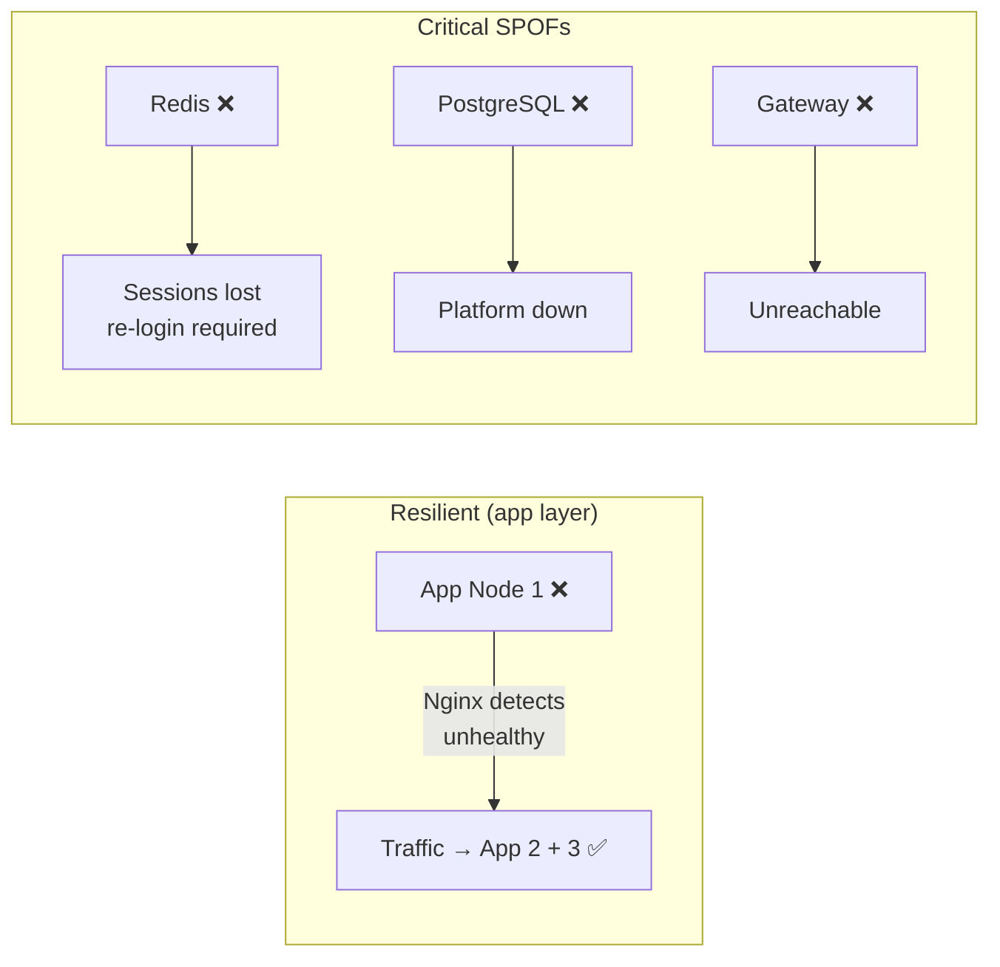

# High Availability CTFd on IBM LinuxONE (s390x)

Capture The Flag (CTF) platforms are highly sensitive to availability, latency, and data consistency. During competitive events, even brief downtime can invalidate the entire experience for participants.

This article documents a **High Availability (HA) architecture for CTFd**, deployed on **IBM LinuxONE (s390x) virtual machines**, using:

- **Nginx** for load balancing
- **PostgreSQL 18** as the centralized database
- **Redis** for session and cache management
- **Docker** for application isolation and portability

The setup is suitable for university competitions, departmental CTFs, and medium-scale public events.

---

## 1. Architecture Overview

The platform follows a classic **3-tier HA design**:




### Node Roles

| Component | Role |
|---|---|
| Gateway | Load balancer + Redis session store |
| DB Server | Central PostgreSQL database |
| App Node 1 | CTFd application |
| App Node 2 | CTFd application |
| App Node 3 | CTFd application |

---

## 2. Design Goals

- **High Availability** — No single application node failure should impact users
- **Stateless Application Layer** — Sessions stored centrally in Redis
- **Data Consistency** — Single authoritative PostgreSQL instance
- **Horizontal Scalability** — Add more CTFd nodes with a single compose up
- **s390x Compatibility** — Native support for IBM LinuxONE architecture

---

## 3. Load Balancing with Nginx

The gateway uses Nginx with the `least_conn` algorithm:

```nginx
upstream ctfd_app {
    least_conn;
    server APP_SERVER_1_IP:80;
    server APP_SERVER_2_IP:80;
    server APP_SERVER_3_IP:80;
}

server {
    listen 80;

    location / {
        proxy_pass http://ctfd_app;
        proxy_set_header Host $host;
        proxy_set_header X-Real-IP $remote_addr;
        proxy_set_header X-Forwarded-For $proxy_add_x_forwarded_for;
    }
}
```

### Why `least_conn`?

CTFd endpoints are not uniform in cost:

| Endpoint | Load |
|---|---|
| Login | Short |
| Flag submission | Moderate |
| Scoreboard render | Heavy |

`least_conn` distributes traffic based on **current active connections**, not just round-robin fairness — so a node processing a heavy scoreboard render won't receive new connections until it catches up.

---

## 4. Centralized Session Handling with Redis

All application nodes point to the same Redis instance:

```bash
REDIS_URL=redis://gateway-ip:6379
```

### Benefits

- Users remain logged in even if requests hit different servers
- Enables sticky-session-free load balancing
- Improves performance for frequent session lookups (Redis avg < 1ms)

Without centralized session storage, a user authenticated on App Node 1 would be logged out the moment Nginx routed their next request to App Node 2.

---

## 5. PostgreSQL 18 Database Layer

The database runs in Docker on a dedicated VM:

```bash
docker run -d \
  --name rootaccess-db \
  -e POSTGRES_USER=ctfd \
  -e POSTGRES_PASSWORD=strong_password \
  -e POSTGRES_DB=ctfd \
  -p 5432:5432 \
  s390x/postgres:18
```

### Why a Single Primary DB?

CTFd performs frequent writes — flag submissions, scoring updates, and challenge unlocks all require strict ordering. A single authoritative PostgreSQL instance avoids replication lag and split-brain scenarios during competition peaks.

Replication can be layered on later (see Future Improvements).

---

## 6. s390x-Optimized CTFd Docker Image

IBM LinuxONE uses the **s390x** architecture. Several critical Python packages do not ship pre-built wheels for it:

| Package | Why It Fails on s390x |
|---|---|
| `cryptography` | Requires Rust; no pre-built wheel |
| `Pillow` | Requires `libjpeg` / `zlib` native compile |
| `psycopg2` | Requires `libpq-dev` native compile |

### Solution: Multi-Stage Docker Build

```dockerfile
FROM python:3.11-slim-bookworm AS build

# System dependencies for native compilation
RUN apt-get update && apt-get install -y \
    build-essential libssl-dev libffi-dev \
    libjpeg-dev zlib1g-dev \
    git curl pkg-config libpq-dev

# Rust toolchain (required for cryptography package)
RUN curl https://sh.rustup.rs | sh -s -- -y
ENV PATH="/root/.cargo/bin:$PATH"

# uv for fast dependency resolution
RUN curl -LsSf https://astral.sh/uv/install.sh | sh
ENV PATH="/root/.local/bin:$PATH"

WORKDIR /app
COPY requirements.txt .
RUN uv pip install --system -r requirements.txt

# --- Runtime stage (minimal) ---
FROM python:3.11-slim-bookworm

RUN apt-get update && apt-get install -y \
    libjpeg62-turbo libpq5 && \
    rm -rf /var/lib/apt/lists/*

COPY --from=build /usr/local/lib/python3.11/site-packages /usr/local/lib/python3.11/site-packages
COPY --from=build /app /app

WORKDIR /app
CMD ["gunicorn", "-w", "4", "-b", "0.0.0.0:8000", "CTFd:create_app()"]
```

The final runtime image contains **only minimal runtime libraries** — the Rust toolchain, build tools, and compile artifacts stay in the build stage only.

---

## 7. Application Configuration (Docker Compose)

Each node runs the same stack with identical environment variables:

```yaml
services:
  ctfd:
    build: .
    restart: always
    ports:
      - "80:8000"
    environment:
      - DATABASE_URL=postgresql://ctfd:strong_password@DB_SERVER_IP:5432/ctfd
      - REDIS_URL=redis://GATEWAY_IP:6379
      - SECRET_KEY=shared_secret_all_nodes_identical
      - REVERSE_PROXY=true
    volumes:
      - ./uploads:/app/CTFd/uploads
      - ./logs:/app/CTFd/logs
```

> **Critical:** `SECRET_KEY` must be **identical on all nodes** — it's used to sign session cookies. A mismatch causes every request routed to a different node to appear as an unauthenticated session.

---

## 8. Firewall Configuration

### Gateway Node

```bash
iptables -I INPUT -p tcp --dport 80 -j ACCEPT
iptables -I INPUT -p tcp --dport 6379 -s APP_SUBNET -j ACCEPT  # Redis: app nodes only
```

### Application Nodes

```bash
iptables -I INPUT -p tcp --dport 80 -j ACCEPT
iptables -I INPUT -p tcp --dport 8000 -j ACCEPT
iptables -I DOCKER-USER -p tcp --dport 8000 -j ACCEPT
```

### DB Node

```bash
iptables -I INPUT -p tcp --dport 5432 -s APP_SUBNET -j ACCEPT  # Postgres: app nodes only
```

Restrict Redis and PostgreSQL to the private subnet — never expose them on public interfaces.

---

## 9. Deployment Workflow

### Initial deploy / rebuild

```bash
# On each app node
docker compose up -d --build
```

### Reload gateway config (zero downtime)

```bash
nginx -t && systemctl reload nginx
```

Zero downtime is achieved as long as at least one app node remains active and healthy during a rolling redeploy.

---

## 10. Fault Tolerance Behavior

| Failure Scenario | Impact | Mitigation |
|---|---|---|
| App node down | Traffic routed to remaining nodes — **transparent** | Add more app nodes |
| Redis down | Sessions invalidated — users must re-login | Redis Sentinel / Cluster |
| PostgreSQL down | Platform fully unavailable | Streaming replication + failover |
| Gateway down | Entire platform unreachable | Second gateway + Keepalived/VRRP |



---

## 11. Performance Characteristics

On LinuxONE s390x (2 vCPU / 4GB RAM per app node):

- ~800–1,200 concurrent users across 3 nodes
- Stable under burst flag submissions (Redis absorbs lookup pressure)
- Low CPU overhead — s390x's crypto acceleration benefits TLS and session signing
- PostgreSQL `COPY` bulk inserts handle mass flag check queues efficiently

---

## 12. Future Improvements

| Improvement | What It Fixes |
|---|---|
| PostgreSQL streaming replication | DB SPOF |
| Redis Sentinel / Redis Cluster | Cache SPOF |
| HTTPS termination (Let's Encrypt or Cloudflare) | Plaintext HTTP in prod |
| Second gateway + Keepalived VRRP | Gateway SPOF |
| Prometheus + Grafana | Observability |
| Nginx rate-limiting | Flag bruteforce / submission flooding |

---

## Conclusion

This setup provides:

- True application-layer high availability — an app node can go down mid-competition and participants won't notice
- Architecture independence via Docker — the same compose file runs on x86_64 and s390x
- Production-safe session handling via centralized Redis
- Optimized build pipeline for IBM LinuxONE's native architecture constraints

It is an excellent foundation for **academic CTF competitions**, departmental events, and internal security training platforms.

If you are deploying CTFd on non-x86 architectures or planning a large-scale competition, this architecture provides a robust and extensible baseline.

Happy hacking. 🚩
