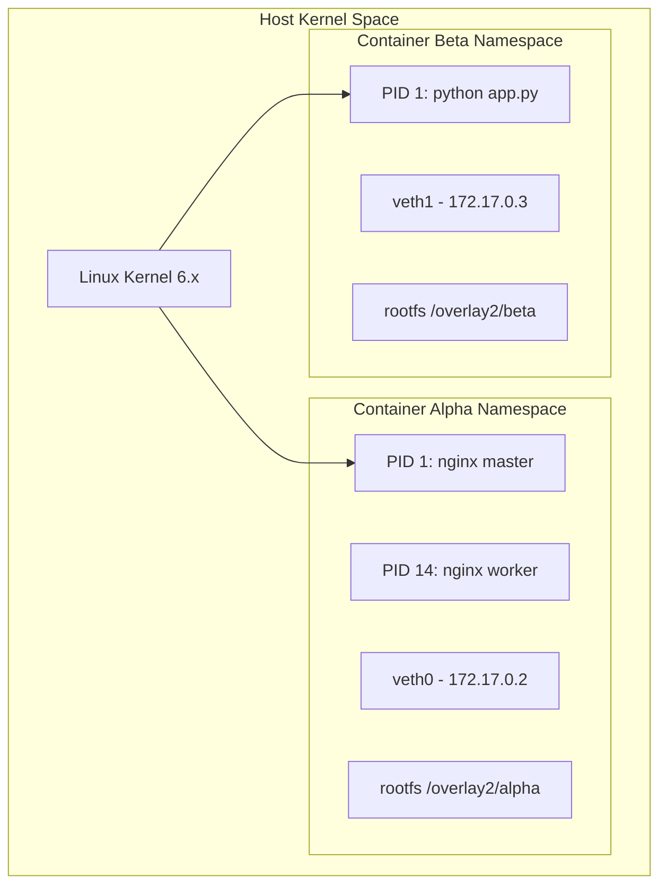

# How Docker Uses Linux Namespaces

Containers are often described as lightweight virtual machines, but under the hood, a container is simply an isolated Linux process. The core mechanism enabling this isolation is the **Linux Namespace** subsystem.

## Introduction to Namespace Isolation

While virtual machines virtualize hardware via a hypervisor, containers virtualize operating system resources. Namespaces wrap global system resources into isolated abstractions:

1. **PID Namespace**: Isolates the process ID space.
2. **NET Namespace**: Virtualizes network interfaces, routes, and firewall rules.
3. **MNT Namespace**: Manages filesystem mount points independently.
4. **IPC Namespace**: Isolates System V IPC and POSIX message queues.
5. **UTS Namespace**: Isolates hostname and NIS domain name.
6. **USER Namespace**: Maps container UID/GID to non-privileged host UIDs.

## Architecture Diagram: Namespace Layering

The following diagram illustrates how the Linux kernel isolates processes running inside Docker containers using namespace barriers.



## Practical Hands-On: System Calls and Inspection

To create a new namespace programmatically in C, Linux provides the `clone()` system call with specific `CLONE_NEW*` flags:

```c
#define _GNU_SOURCE
#include <sched.h>
#include <stdio.h>
#include <stdlib.h>
#include <sys/wait.h>
#include <unistd.h>

#define STACK_SIZE (1024 * 1024)
static char child_stack[STACK_SIZE];

static int child_fn(void *arg) {
    printf("Child PID in isolated namespace: %d\n", getpid());
    system("hostname container-node-01");
    return 0;
}

int main() {
    printf("Host PID: %d\n", getpid());
    
    // Spawn process in new PID, NET, and UTS namespaces
    int child_pid = clone(child_fn, child_stack + STACK_SIZE,
                          CLONE_NEWPID | CLONE_NEWNET | CLONE_NEWUTS | SIGCHLD, NULL);
    
    if (child_pid == -1) {
        perror("clone failed");
        exit(EXIT_FAILURE);
    }
    
    waitpid(child_pid, NULL, 0);
    return 0;
}
```

You can inspect the active namespaces of any running process via `/proc`:

```bash
# List namespaces for Docker container process PID 4820
ls -l /proc/4820/ns/

# Output example:
# lrwxrwxrwx 1 root root 0 Jul 20 10:00 net -> 'net:[4026532258]'
# lrwxrwxrwx 1 root root 0 Jul 20 10:00 pid -> 'pid:[4026532259]'
# lrwxrwxrwx 1 root root 0 Jul 20 10:00 mnt -> 'mnt:[4026532257]'
```

## Isolation Complexity and Formal Model

The computational overhead of namespace isolation lookup in the Linux kernel kernel scheduler is negligible. Namespace checks operate in $O(1)$ constant time during task switching:

$$\text{Overhead}_{\text{switch}} = O(1)$$

The total isolation boundary matrix $\mathcal{I}$ across $K$ namespaces for $N$ container processes is defined as:

$$\mathcal{I}(N) = \prod_{k=1}^{K} \mathcal{S}_k \quad \text{where } K \in \{\text{PID}, \text{NET}, \text{MNT}, \text{IPC}, \text{UTS}, \text{USER}\}$$

Where $\mathcal{S}_k$ represents the lookup space bounded by each kernel sub-namespace table.

## Conclusion

Linux namespaces form the foundation of container security and multi-tenancy. By combining namespaces with cgroups, Docker achieves virtual machine-like isolation with near-zero runtime performance penalty.
