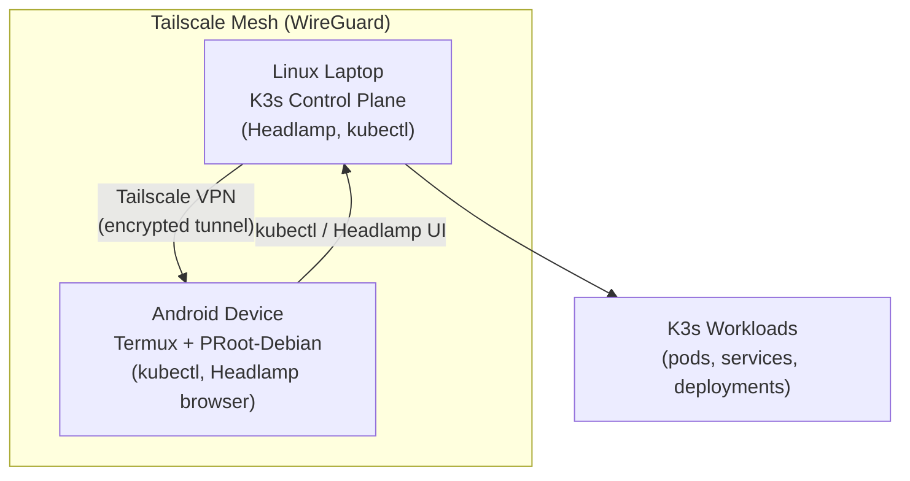
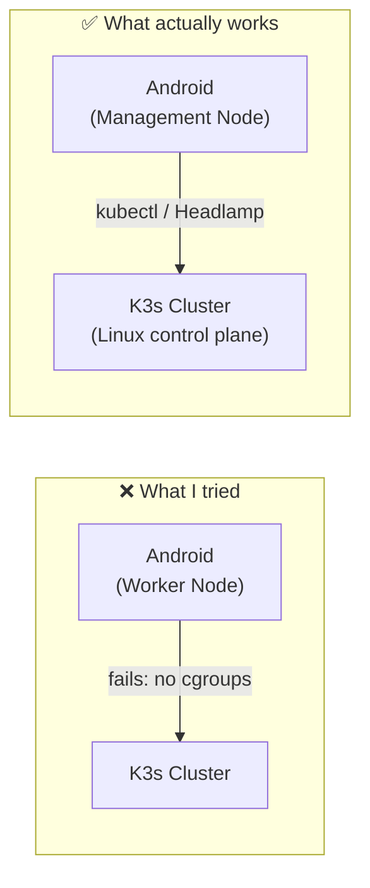

# Managing K3s from an Android Device

This guide outlines how to build a hybrid Kubernetes environment where a **Linux laptop acts as the powerhouse (Control Plane)** and an **Android device serves as the Remote Command Center**.

By leveraging **K3s**, **Tailscale**, and **Headlamp**, you can maintain full cluster oversight from your pocket without sacrificing the stability of your workloads.

---

## The Vision & Architecture

The goal was simple: **Control the cluster from anywhere.** While the heavy lifting stays on the Linux laptop, the Android device becomes a fully functional management node. We bridge these two worlds using a secure WireGuard-based mesh network.




---

## Phase 1: Setting up the Control Plane (Linux)

We use **K3s** for its lightweight footprint. The critical step here is ensuring the API server recognizes our private VPN traffic.

### 1. K3s Installation

Run the following command, replacing `<PRIVATE_VPN_IP>` with your laptop's Tailscale IP:

```bash
curl -sfL https://get.k3s.io | INSTALL_K3S_EXEC="--tls-san <PRIVATE_VPN_IP> --write-kubeconfig-mode 644" sh -
```

> **Note:** The `--tls-san` flag is vital; without it, the API server will reject connections from your mobile device due to certificate mismatches.

### 2. Deploying the Headlamp Dashboard

For a mobile-friendly UI, we deploy **Headlamp** via Helm:

```bash
helm repo add headlamp https://kubernetes-sigs.github.io/headlamp/
helm install headlamp headlamp/headlamp \
  --namespace headlamp \
  --create-namespace \
  --set service.type=NodePort
```

---

## Phase 2: The Mobile Command Center (Android)

To manage a cluster from Android, we need a "Linux-lite" environment and a secure tunnel back home.

### 1. The Environment

- **Termux:** Provides the base terminal and package management.
- **PRoot-Debian:** Installed within Termux to provide a standard filesystem compatible with `kubectl`.

```bash
# Inside Termux
pkg install proot-distro
proot-distro install debian
proot-distro login debian

# Inside PRoot-Debian
apt update && apt install -y curl
curl -LO "https://dl.k8s.io/release/$(curl -Ls https://dl.k8s.io/release/stable.txt)/bin/linux/arm64/kubectl"
chmod +x kubectl && mv kubectl /usr/local/bin/
```

### 2. Secure Networking (Tailscale)

By installing **Tailscale** on both the laptop and Android:

- Both devices share a private virtual network.
- No port forwarding or public IP exposure is required.
- The Android device can "see" the laptop as if they were on the same local Wi-Fi.

Install Tailscale from the Play Store, sign in, and both devices will appear in your tailnet.

---

## Phase 3: Linking the Devices

Once the network is live, we need to give the Android device the "keys" to the cluster.

### 1. Transferring Credentials

Pull the `kubeconfig` from your laptop to your mobile environment:

```bash
scp <user>@<laptop_tailscale_ip>:~/.kube/config ~/.kube/config
```

### 2. Updating the Endpoint

Point the config to the VPN address instead of the local loopback:

```bash
sed -i "s/127.0.0.1/<LAPTOP_TAILSCALE_IP>/g" ~/.kube/config
```

### 3. Verify the Connection

```bash
kubectl get nodes
kubectl get pods --all-namespaces
```

If nodes appear, your Android device is now a fully functional Kubernetes management client.

---

## The Pivot: Why Mobile Nodes Fail

### What I Initially Tried

I initially attempted to join the Android device to the cluster as a **Worker Node** — run lightweight pods directly on the phone.

### What I Discovered (The Reality Check)

Kubernetes has strict kernel requirements that non-rooted Android environments simply cannot meet:

| Requirement | Why It Fails on Android |
|---|---|
| **Cgroups & Namespaces** | PRoot simulates Linux but can't access kernel-level resource management |
| **Container Runtime** | `containerd`/`docker` require low-level syscalls restricted in user-space |
| **SysFS Access** | `/sys` and `/proc` are heavily guarded — Kubelet can't initialize |
| **iptables / nftables** | Network policy enforcement requires root and kernel modules |

### The Solution

Shift the architecture: instead of a **Worker Node**, the Android device becomes a **Management Node**. It holds the power to deploy, scale, and monitor — while the laptop handles actual execution.



---

## Conclusion

While Android isn't ready to host your pods, it is a remarkably capable platform for **remote orchestration**. With `kubectl` in Termux and Headlamp in your mobile browser, you have a professional-grade NOC (Network Operations Center) in your pocket.

The key insight: **separate the management plane from the data plane.** Your phone is an excellent management plane client. Leave the data plane to Linux.
