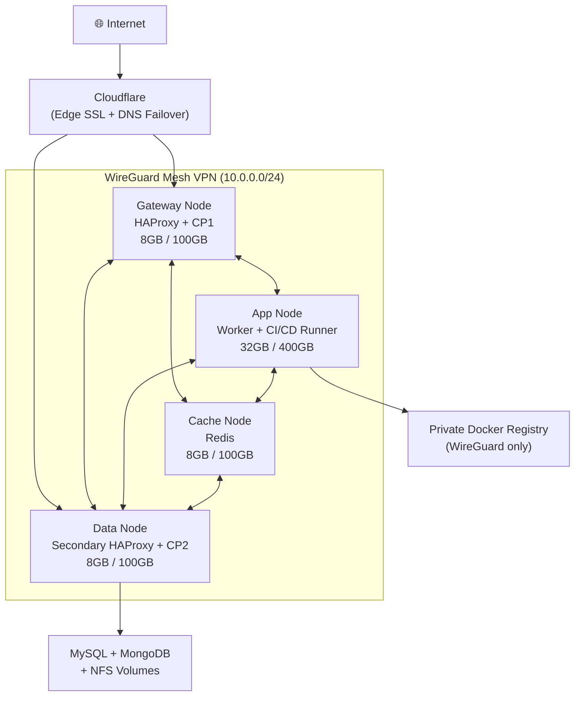
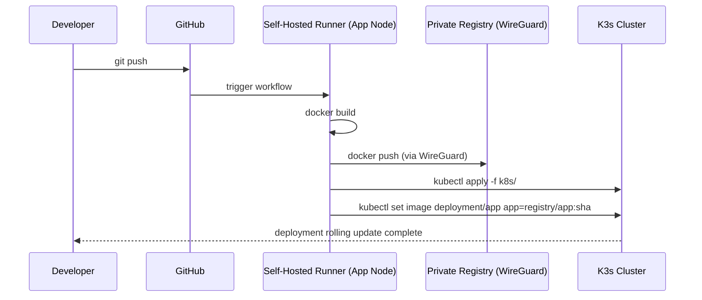

# Production K3s on VPS: A 4-Node Architecture with HA, Monitoring, and CI/CD

Running Kubernetes does not always require managed cloud platforms such as AWS, GCP, or Azure. For small-to-medium production workloads, a carefully designed K3s deployment on commodity VPS infrastructure can deliver high availability, observability, and CI/CD automation at a significantly lower cost.

This article presents a production-oriented architecture built on four VPS nodes, interconnected through a private mesh VPN, fronted by edge DNS failover, and equipped with monitoring and automated deployments.

The objective is not merely to run Kubernetes, but to design a resilient system with clear separation of concerns, minimal operational overhead, and controlled expenditure.

---

## Architecture Overview


The cluster consists of four VPS instances, each assigned a distinct responsibility:

| Node | Resources | Primary Role |
|---|---|---|
| Gateway Node | 8GB RAM / 100GB Disk | HAProxy, K3s Control Plane 1, Prometheus |
| App Node | 32GB RAM / 400GB Disk | K3s Control Plane 2 + Worker, CI/CD Runner |
| Cache Node | 8GB RAM / 100GB Disk | Redis |
| Data Node | 8GB RAM / 100GB Disk | MySQL, MongoDB, NFS, Docker Registry, Secondary Gateway |

The key design principle is **functional isolation**: compute-heavy workloads reside on the app node, stateful services live on the data node, caching is isolated, and ingress is distributed.



---

## 1. WireGuard Mesh VPN — The Network Backbone

All nodes are interconnected using WireGuard in a full-mesh topology over a private `/24` subnet.

### Why WireGuard?

- Kernel-space implementation → high throughput
- Minimal configuration → single config per peer
- Strong cryptography → reduced attack surface
- Simple routing model → predictable connectivity

With four nodes in full mesh, there are $\binom{4}{2} = 6$ peer connections. Every combination was validated to ensure reliable connectivity.

### Architectural Advantage

Because all inter-node traffic flows through WireGuard:

- The Docker registry can operate over HTTP (encrypted by VPN tunnel).
- Databases can bind exclusively to private IPs.
- No public exposure of internal services is required.

This significantly reduces the attack surface.

---

## 2. Database and Storage Layer

The data node centralizes persistent storage.

### MySQL as K3s Datastore

Instead of etcd, K3s is configured to use MySQL as the cluster datastore.

**Rationale:**
- Familiar backup procedures (mysqldump, replication)
- Operational simplicity
- Easier monitoring with existing exporters
- Reduced distributed-system complexity

```bash
# K3s server with external MySQL datastore
curl -sfL https://get.k3s.io | sh -s - server \
  --datastore-endpoint="mysql://<user>:<pass>@tcp(<data-node-vpn-ip>:3306)/k3s" \
  --tls-san <gateway-public-ip> \
  --tls-san <gateway-vpn-ip>
```

### Additional Services

- MongoDB for document-based workloads
- NFS for shared persistent volumes
- Private Docker registry accessible only via WireGuard

---

## 3. Redis on a Dedicated Node

The cache node runs Redis with:

- 6GB memory limit
- `allkeys-lru` eviction
- Append-Only File (AOF) persistence
- Binding to WireGuard interface only

```bash
# redis.conf excerpt
maxmemory 6gb
maxmemory-policy allkeys-lru
appendonly yes
bind 10.0.0.3 127.0.0.1
```

Isolating Redis prevents memory contention with application workloads.

---

## 4. Dual Control Plane K3s

K3s runs in dual control-plane mode:

- CP1 → Gateway Node
- CP2 → App Node
- Shared MySQL datastore

If one control plane fails, the second continues serving API requests.

### Availability Calculation

For a dual control plane where each node has uptime probability $P$:

$$A = 1 - (1 - P)^2$$

For example, if each node has 99% uptime ($P = 0.99$):

$$A = 1 - (1 - 0.99)^2 = 1 - 0.0001 = 99.99\%$$

Dual control planes significantly increase effective API availability compared to a single control plane.

---

## 5. Dual Gateway with DNS Failover

Both gateway nodes run HAProxy. Traffic flows as:

```
Client → Cloudflare (Edge SSL) → HAProxy (Origin SSL termination) → Traefik → K8s Services
```

Cloudflare uses multiple A records for failover. If one gateway becomes unreachable, DNS routing shifts automatically.

**SSL strategy:**
- Public SSL handled by Cloudflare
- Origin certificate on HAProxy
- Internal traffic in plaintext over WireGuard

This ensures encryption without certificate sprawl inside the cluster.

---

## 6. Traefik v3 as Ingress

Traefik runs as a DaemonSet using `hostPort: 80`.

### Why DaemonSet?

Guarantees ingress presence on all nodes, allowing HAProxy to distribute traffic evenly.

### Why `hostPort` instead of `NodePort`?

NodePort introduces an additional hop via kube-proxy. `hostPort` enables direct socket binding → reduced latency and simplified routing.

```yaml
# traefik-daemonset excerpt
spec:
  hostNetwork: false
  containers:
    - name: traefik
      ports:
        - name: http
          containerPort: 80
          hostPort: 80
        - name: https
          containerPort: 443
          hostPort: 443
```

---

## 7. Monitoring Stack

Monitoring is deployed using `kube-prometheus-stack`:

- Prometheus
- Grafana
- Node Exporter (systemd on non-K3s nodes)
- Redis Exporter
- MySQL Exporter

Non-cluster nodes (Cache, Data) are scraped using `additionalScrapeConfigs`. Dashboards are proxied through Cloudflare for secure access.

---

## 8. CI/CD Integration

The app node runs a GitHub Actions self-hosted runner.



Running the runner inside the cluster network removes the need to expose the Kubernetes API publicly.

---

## 9. Automated Image Cleanup

To prevent storage exhaustion:

```bash
# /etc/cron.d/registry-cleanup
0 2 * * * root docker exec registry registry garbage-collect /etc/docker/registry/config.yml
30 2 * * * root docker system prune -f
```

---

## Pros and Cons

### Advantages

1. ~80% cost reduction compared to managed Kubernetes
2. Full infrastructure control — no vendor lock-in
3. No inter-node egress costs (WireGuard is free)
4. Private networking simplifies security posture
5. Modular scaling — adding workers is a single `k3s agent` join command

### Trade-offs

| Area | Risk | Mitigation |
|---|---|---|
| **Operational complexity** | You own patching, upgrades, etcd | Automation, runbooks |
| **Single datastore** | MySQL SPOF halts control plane | MySQL replication / Galera |
| **VPS reliability** | No hyperscaler SLA | Multi-provider placement |
| **Backup responsibility** | MySQL, Mongo, Redis, NFS all manual | Off-site cron + monitoring |
| **Security surface** | HAProxy/Cloudflare misconfig exposure | Regular audits, least-privilege firewall rules |

---

## Future Improvements

- Automated off-site backups (Restic + S3-compatible)
- Log aggregation (Loki or EFK stack)
- MySQL replication for datastore HA
- GitOps with ArgoCD or Flux
- Infrastructure-as-Code (Terraform + Ansible)

---

## Final Thoughts

A self-managed K3s cluster across VPS nodes is a powerful alternative to managed Kubernetes when:

- Workloads are moderate in scale
- Engineering resources are available for operations
- Cost efficiency is a priority
- Full infrastructure control is desired

It trades **convenience for sovereignty**. When designed carefully — with isolation, monitoring, and redundancy — it can achieve production-grade reliability at a fraction of hyperscaler cost. But only if operational discipline is maintained.
