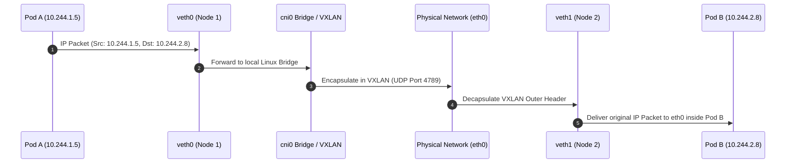

# Kubernetes Networking Deep Dive

Kubernetes networking imposes a simple foundational principle: **Every Pod gets its own unique IP address**, and all Pods can communicate with all other Pods without NAT (Network Address Translation).

## The Four Fundamental Kubernetes Networking Requirements

1. **Container-to-Container**: Handled via localhost in the shared NET namespace.
2. **Pod-to-Pod**: Direct IP reachability across all nodes in the cluster.
3. **Pod-to-Service**: Virtual IP load balancing managed by `kube-proxy` or eBPF.
4. **External-to-Service**: Ingress controllers, NodePorts, and LoadBalancers.

## Pod-to-Pod Packet Routing Sequence

When Pod A (`10.244.1.5`) on Node 1 sends an HTTP request to Pod B (`10.244.2.8`) on Node 2, the traffic traverses virtual interfaces, overlay encapsulation, and physical networks.



## Service Abstraction: iptables vs eBPF (Cilium)

Historically, `kube-proxy` programmed Linux `iptables` rules to route Service ClusterIPs to backing Pod IPs. However, iptables evaluates rules sequentially, leading to $O(N)$ algorithmic complexity where $N$ is the total number of Service endpoints.

### Algorithmic Lookup Comparison

$$\text{Time}_{\text{iptables}}(N) = O(N)$$

$$\text{Time}_{\text{eBPF}}(N) = O(1)$$

Modern CNI implementations like **Cilium** leverage **eBPF (Extended Berkeley Packet Filter)** to hook into socket layers and XDP (eXpress Data Path), replacing iptables sequential rules with $O(1)$ BPF hash tables:

```bash
# Tracing eBPF maps in Cilium
bpftool map dump name cilium_lb4_services

# Inspecting legacy iptables rules created by kube-proxy
iptables-save | grep KUBE-SERVICES | head -n 10
```

## VXLAN Overlay Header Overhead Calculation

When using overlay networking (such as Flannel or Calico in VXLAN mode), an outer UDP packet wraps the original Ethernet frame. This introduces a 50-byte header overhead:

$$\text{Header}_{\text{overhead}} = \text{IP}_{\text{hdr}} (20\text{B}) + \text{UDP}_{\text{hdr}} (8\text{B}) + \text{VXLAN}_{\text{hdr}} (8\text{B}) + \text{Eth}_{\text{hdr}} (14\text{B}) = 50\,\text{Bytes}$$

To prevent packet fragmentation, the pod MTU (Maximum Transmission Unit) must be adjusted relative to the physical interface MTU (typically 1500 bytes):

$$\text{MTU}_{\text{pod}} = \text{MTU}_{\text{phys}} - \text{Header}_{\text{overhead}} = 1500 - 50 = 1450\,\text{Bytes}$$

## Hands-On: Tracing Packet Paths with `ip route` and `tcpdump`

```bash
# 1. View veth interfaces on the host node
ip link show type veth

# 2. View container routing table inside pod
kubectl exec -it web-pod-a -- ip route show

# 3. Capture VXLAN traffic on host interface eth0
sudo tcpdump -i eth0 -n "udp port 4789"
```

## Conclusion

Understanding Kubernetes networking down to packet encapsulation, MTU calculations, and eBPF kernel hooks is vital for troubleshooting high-throughput microservices and architecting zero-trust mesh networks.
