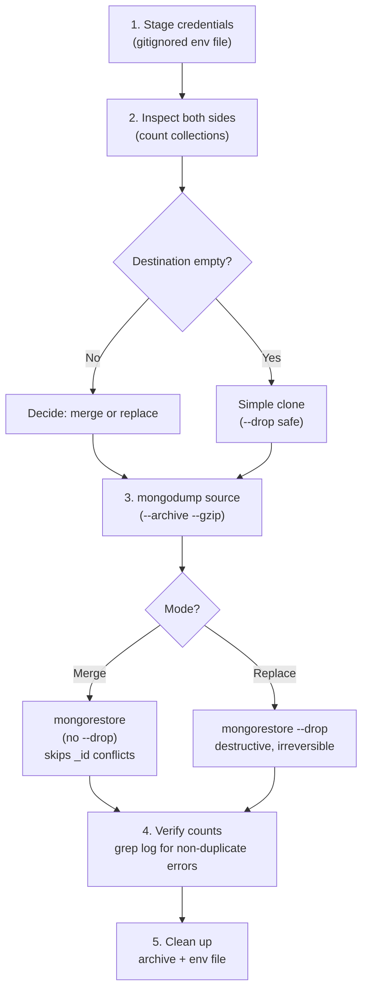
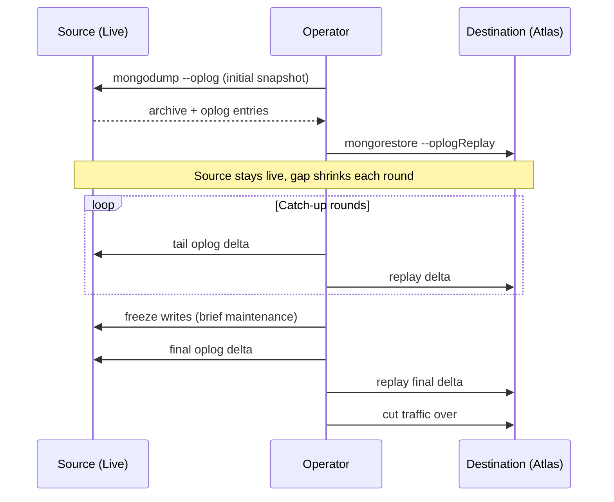

# Moving Data Between MongoDB Deployments Without Overwriting Production

Sooner or later, almost every team ends up moving data between MongoDB deployments — standing up a new production cluster on Atlas, consolidating a staging box into prod, or syncing a partner's on-prem database into your managed cluster. It sounds like a one-liner ("just dump and restore it"), and often it is — until the destination already has live data, or you need zero downtime, or someone asks "wait, did we just overwrite three months of production data?"

This post walks through the core `mongodump` / `mongorestore` workflow, then covers the variations that come up in practice: merges vs. full replaces, partial migrations, renaming on the fly, continuous sync, and when to reach for a managed migration service instead of doing it by hand.

All commands below use placeholders (`<user>`, `<password>`, `<host>`, etc.) — swap in real values from a secrets manager or a local, git-ignored env file. Never paste live credentials into a shell history, a script committed to a repo, or a chat window.

---

## The Baseline Scenario: One-Time Copy Into a Database That Already Has Data

This is the case most people actually mean when they say "migrate the database": copy everything from a source into an Atlas cluster that isn't empty — so you can't just treat it like a fresh restore.



### 1. Stage the Credentials

```bash
# migrate_mongodb.env  (gitignored, never committed)
SRC_MONGO="mongodb://<user>:<password>@<src-host>:<port>/?authSource=admin"
DEST_MONGO="mongodb+srv://<user>:<password>@<atlas-cluster-host>"
DB_NAME="<database_name>"
```

```bash
source migrate_mongodb.env
```

A common gotcha: if the source URI's path segment already names a database (e.g. `.../admin`), it collides with `--db` on the command line. Use `/?authSource=admin` with no database in the path, and pass the target database explicitly via `--db`.

### 2. Look Before You Leap

Before moving a single byte, diff the two sides. This is read-only and takes seconds, but it's the single most important step — it tells you whether you're doing a clean copy or a real merge:

```bash
mongosh "$SRC_MONGO" --quiet --eval '
  db.getSiblingDB("'"$DB_NAME"'").getCollectionNames().sort().forEach(c => {
    const n = db.getSiblingDB("'"$DB_NAME"'").getCollection(c).countDocuments();
    if (n > 0) print(c + ": " + n);
  });
'

mongosh "$DEST_MONGO/$DB_NAME" --quiet --eval '
  db.getCollectionNames().sort().forEach(c => {
    const n = db.getCollection(c).countDocuments();
    if (n > 0) print(c + ": " + n);
  });
'
```

If the destination count is zero everywhere, you're doing a simple clone. If it's not, stop and decide deliberately how conflicts should be handled — that's the difference between the next two sections.

### 3. Dump the Source

```bash
mongodump --uri="$SRC_MONGO" \
  --db="$DB_NAME" \
  --archive="./${DB_NAME}.archive" \
  --gzip
```

This only reads from the source. It's safe to run against a live production system (though consider running it against a secondary/replica to avoid adding load to the primary).

### 4. Restore — Merge Mode (the Safe Default)

Without `--drop`, `mongorestore` never deletes anything. It inserts documents that don't already exist in the destination; documents whose `_id` (or another unique index) already exists there are skipped with a duplicate-key error. That's expected, not a bug:

```bash
mongorestore \
  --uri="$DEST_MONGO" \
  --db="$DB_NAME" \
  --archive="./${DB_NAME}.archive" \
  --gzip \
  --nsFrom="${DB_NAME}.*" --nsTo="${DB_NAME}.*"
```

Capture the log so you can distinguish "expected duplicate" from "something actually broke":

```bash
mongorestore ... > restore.log 2>&1
grep -c "duplicate key error" restore.log
grep -i "error" restore.log | grep -vi "duplicate key error"   # should be empty
```

A useful property of merge mode: it's **idempotent**. Running it a second time will report the previously-inserted documents as duplicates too, with zero data loss — a cheap way to confirm that every failure really was a duplicate-key collision and nothing else.

### 5. Restore — Full Replace (Only When You Mean It)

If the destination should end up an exact mirror of the source, add `--drop`. This deletes each target collection before restoring into it. It's fast and simple, but destructive and not reversible without a prior backup:

```bash
mongorestore \
  --uri="$DEST_MONGO" \
  --db="$DB_NAME" \
  --archive="./${DB_NAME}.archive" \
  --gzip \
  --drop \
  --nsFrom="${DB_NAME}.*" --nsTo="${DB_NAME}.*"
```

Use this for lower environments (staging, dev) or for a cutover where you've already confirmed nothing on the destination is worth keeping — not as a shortcut when you haven't checked what's there.

### 6. Verify and Clean Up

Re-run the count query from step 2 against the destination. Sanity-check that the totals make sense: for a merge, expect roughly source + (destination-only records); for a full replace, expect an exact match to the source.

```bash
rm -f "./${DB_NAME}.archive" restore.log migrate_mongodb.env
```

Dump archives contain real data, and the env file contains credentials — don't leave either lying around once you're done.

---

## Other Scenarios You'll Run Into

### Migrating Only Some Collections

You rarely need the whole database. `--collection` (dump) and `--nsInclude` / `--nsExclude` (restore) let you scope the operation:

```bash
mongodump --uri="$SRC_MONGO" --db="$DB_NAME" \
  --collection="users" --archive="./users.archive" --gzip

mongorestore --uri="$DEST_MONGO" \
  --nsInclude="${DB_NAME}.users" \
  --archive="./users.archive" --gzip
```

Useful for pulling in one reference/config collection without touching unrelated data, or for splitting a large migration into reviewable chunks.

### Migrating Only Some Documents (Filtered Export)

`mongodump --query` takes a JSON filter, letting you export a slice — e.g. only active accounts, or only records created after a cutover date:

```bash
mongodump --uri="$SRC_MONGO" --db="$DB_NAME" --collection="orders" \
  --query='{"status": "active"}' \
  --archive="./orders_active.archive" --gzip
```

Handy for staging environments that should only get a realistic sample, or for re-running a migration incrementally by date:

```bash
--query='{"created_at": {"$gte": {"$date": "2026-06-01T00:00:00Z"}}}'
```

### Renaming a Database or Collection in Transit

`--nsFrom` / `--nsTo` support wildcard remapping, so the destination namespace doesn't have to match the source:

```bash
mongorestore --uri="$DEST_MONGO" \
  --archive="./${DB_NAME}.archive" --gzip \
  --nsFrom="staging_app.*" --nsTo="production_app.*"
```

This is how you consolidate a differently-named staging/dev database into its production counterpart, or namespace multiple source tenants into one destination database with prefixes.

### Continuous / Incremental Sync (Near-Zero Downtime)

A single dump/restore gives you a point-in-time snapshot — anything written to the source after the dump starts is missed. For a cutover where you need to minimize downtime:



This is the manual version of what tools like `mongosync` or Atlas's **Live Migrate** feature automate for you.

### Sharded Clusters

Everything above assumes a single replica set on each side. Migrating a sharded cluster (or migrating *into* a sharded Atlas cluster) adds real complexity: shard key selection, chunk distribution, and balancer behavior during the load. `mongodump`/`mongorestore` still work, but for anything beyond a small dataset, MongoDB's guidance is to use `mongosync` or Atlas Live Migrate rather than hand-rolled dump/restore.

### When to Skip the Manual Tooling Entirely

| Scenario | Use |
|---|---|
| One-off, small-to-medium dataset | `mongodump` / `mongorestore` |
| Fine-grained control (filters, renames, merge semantics) | `mongodump` / `mongorestore` |
| Existing destination with data to reconcile | `mongodump` / `mongorestore` |
| Full production lift-and-shift, near-zero downtime | Atlas Live Migrate / `mongosync` |
| Sharded cluster → sharded Atlas cluster | Atlas Live Migrate / `mongosync` |

### Rollback Strategy

Whichever path you take, take a backup of the **destination** before you restore into it, even in merge mode — Atlas's continuous backups / snapshots make this cheap, and it turns "we made a mistake" into "restore the snapshot" instead of a forensic data-recovery exercise.

---

## Takeaways

- **Never restore into a destination you haven't first inspected** — a five-second count comparison tells you whether you're doing a clone or a merge, and picking the wrong one is the most common way this goes wrong.
- **`--drop` is the line between reversible and irreversible.** Default to merge mode; use `--drop` only when you've deliberately decided the destination's current data doesn't matter.
- **Duplicate-key errors during a merge restore are usually the *expected* outcome**, not a failure — grep the log for anything that isn't a duplicate-key error, not for the presence of errors at all.
- **Scale the tool to the job**: `mongodump`/`mongorestore` for one-off, controllable migrations; oplog replay or Atlas Live Migrate for anything needing near-zero downtime or ongoing sync.
- **Clean up dump archives and credential files immediately after** — they're real production data and real secrets sitting on disk.
