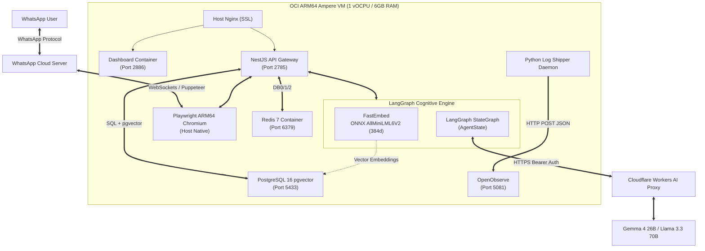
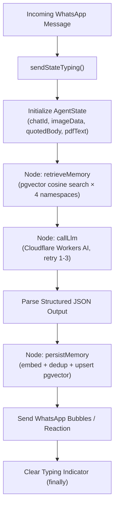
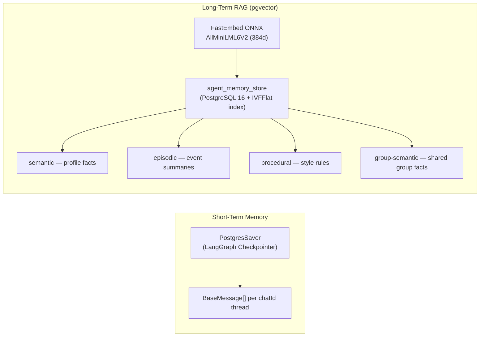

# Building an AI Layer on OpenWA

OpenWA is an open-source WhatsApp API gateway built on `whatsapp-web.js` and NestJS. What it doesn't ship with — and what I built on top of it — is a full **agentic AI stack**: stateful multi-turn conversations with LangGraph, cloud LLM inference via Cloudflare Workers AI, dual-layer memory using PostgreSQL `pgvector` and local ONNX embeddings, and real-time observability via OpenObserve.

This post documents what I added, the engineering decisions behind each choice, and the specific challenges of running this on **Oracle Cloud Infrastructure ARM64 Ampere**.

> **The base** — `whatsapp-web.js` session management, the NestJS gateway, and the React dashboard — is open-source. **What I built**: the LangGraph cognitive engine, the Cloudflare Workers AI proxy, the dual-layer memory architecture, FastEmbed vectorization, and the entire OCI deployment with Podman Quadlets and the Python OpenObserve log shipper.

---

## What the Stack Looks Like




---

## Problem 1: The ARM64 Browser Crash

The first thing I hit deploying on OCI ARM64 was a renderer crash: `Page crashed!` right after `WA loading: 100%`.

The culprit: Ubuntu's `/usr/bin/chromium` is a **shell wrapper** that injects `--enable-gpu-rasterization` and extension-loading flags — flags that crash the renderer on a headless ARM VM. Puppeteer's default download also pulls an x86_64 binary.

**Fix**: bypass system packages entirely and point Puppeteer at Playwright's standalone ARM64 Chromium:

```bash
npx --yes playwright install chromium
```

Then pin it in the systemd service unit:

```ini
# openwa-api.service
Environment=PUPPETEER_EXECUTABLE_PATH=/home/ubuntu/.cache/ms-playwright/chromium-1228/chrome-linux/chrome
```

Combined with `LocalAuth` disk-persisted sessions, the service survives restarts without QR rescans.

---

## What I Built: The AI Layer

### 1. Cloudflare Workers AI Proxy

Rather than running inference locally (no GPU on the ARM VM), I deployed a Cloudflare Worker that proxies requests to Workers AI models with Bearer token auth:

- **Primary**: `@cf/google/gemma-4-26b-a4b-it`
- **Fallback**: `@cf/meta/llama-3.3-70b-instruct-fp8-fast`

The proxy handles **multi-modal vision** — WhatsApp image attachments are converted to base64 data URIs and injected directly into the payload. PDFs get extracted via `pdf-parse` and attached as text context.

Resilience: 3-attempt exponential backoff on `503` / `429` responses.

**Human-like mechanics I added on top:**
- `||` delimiter splits responses into multiple WhatsApp bubbles (up to 3 per turn)
- Emoji `reaction` field — returns a single emoji instead of text for simple acknowledgments
- `sendStateTyping()` fires before inference, cleared in a `finally` block — the user sees "typing..." on their phone

### 2. LangGraph Stateful Agent

The auto-reply system runs as a `StateGraph` inside `gemini-reply.service.ts`. Every inbound message flows through four nodes:



The `AgentState` carries everything through the graph:

```typescript
const AgentState = Annotation.Root({
  ...MessagesAnnotation.spec,   // BaseMessage[] trajectory
  chatId: Annotation<string>(),
  imageData: Annotation<string>(),
  imageMimetype: Annotation<string>(),
  pdfText: Annotation<string>(),
  quotedBody: Annotation<string>(),
  memoryContext: Annotation<string>(),
  structured: Annotation<GeminiStructuredOutput | null>(),
});
```

The LLM returns a validated JSON schema every turn: `reply`, `reaction`, `intent`, `sentiment`, `abuse`, `newSemanticFacts`, `episodeSummary`, `communicationStyle`.

### 3. Dual-Layer Memory Architecture

This was the most interesting engineering challenge. A stateless LLM has no memory between sessions. I built two layers:



**Short-term**: `PostgresSaver` (LangGraph's built-in checkpointer) stores the full `BaseMessage[]` trajectory per `chatId` thread.

**Long-term**: Each turn, the LLM extracts `newSemanticFacts` and an `episodeSummary`. These get embedded with FastEmbed and upserted into `agent_memory_store`. On the next turn, the `retrieveMemory` node runs a cosine similarity search across all four namespaces and injects the top-3 results into the system prompt.

### 4. Local ONNX Embeddings with FastEmbed

I deliberately chose **not** to use OpenAI embeddings or any paid API. `fastembed` runs the `AllMiniLML6V2` ONNX model locally on CPU:

```typescript
export class FastEmbedEmbeddings extends Embeddings {
  async embedDocuments(texts: string[]): Promise<number[][]> {
    const results: number[][] = [];
    for await (const batch of this.model.embed(texts)) {
      results.push(...batch);
    }
    return results;
  }
  async embedQuery(text: string): Promise<number[]> {
    return this.model.queryEmbed(text);
  }
}
```

**Zero external API calls. Zero billing. Zero latency from network round-trips.**

### 5. pgvector Schema & Cosine Search

```sql
CREATE TABLE IF NOT EXISTS agent_memory_store (
  namespace_str TEXT NOT NULL,
  namespace     JSONB NOT NULL,
  key           TEXT NOT NULL,
  value         JSONB NOT NULL,
  embedding     vector(384),
  created_at    TIMESTAMPTZ NOT NULL DEFAULT NOW(),
  updated_at    TIMESTAMPTZ NOT NULL DEFAULT NOW(),
  PRIMARY KEY (namespace_str, key)
);

CREATE INDEX IF NOT EXISTS idx_memory_embedding
  ON agent_memory_store USING ivfflat (embedding vector_cosine_ops)
  WITH (lists = 10);
```

The cosine search at retrieval time:

```typescript
const res = await this.pool.query(
  `SELECT namespace, key, value,
          1 - (embedding <-> $1::vector) AS score
   FROM agent_memory_store
   WHERE namespace_str = $2 AND embedding IS NOT NULL
   ORDER BY embedding <-> $1::vector
   LIMIT $3`,
  [embeddingStr, nsStr, limit],
);
```

**Episodic deduplication**: before writing a new `episodeSummary`, I compute cosine similarity against existing episodic memories. Similarity ≥ 0.92 → skip write. This prevents memory bloat from near-identical summaries of similar interactions.

**Dead Letter Queue**: failed memory writes (after 3 retries with backoff) are pushed to Redis `openwa:dlq:memory` for async inspection:

```typescript
await this.redis.lpush('openwa:dlq:memory', JSON.stringify({ ...payload, ts: new Date().toISOString() }));
await this.redis.ltrim('openwa:dlq:memory', 0, 999);
```

---

## Infrastructure: Podman Quadlets on OCI

All peripheral services run as rootless Podman containers, managed by systemd Quadlet unit generators (`~/.config/containers/systemd/`):

| Quadlet | Service | Port |
|---|---|---|
| `openwa-postgres.container` | PostgreSQL 16 + pgvector | 5433 |
| `openwa-redis.container` | Redis 7 Alpine (DB0=queues, DB1=cache, DB2=memory/DLQ) | 6379 |
| `openwa-dashboard.container` | React + Vite UI | 2886 |
| `openwa-openobserve.container` | OpenObserve log engine | 5081 |

The NestJS API and Playwright Chromium run as **host-native systemd user services** — this is required because Puppeteer needs direct access to the host's Chromium binary and display environment.

---

## Observability: OpenObserve + Python Journald Shipper

Instead of standing up a full ELK stack or Grafana Loki, I built a lightweight Python daemon that tails systemd journald in real-time and ships batched JSON to OpenObserve:

```python
SOURCES = [
    {"unit": "openwa-api.service",      "stream": "openwa_api",     "user": True},
    {"unit": "openwa-postgres.service", "stream": "openwa_postgres", "user": True},
    {"unit": "openwa-redis.service",    "stream": "openwa_redis",    "user": True},
]

def send_batch(stream, events):
    body = json.dumps(events).encode()
    req = urllib.request.Request(
        f"{OPENOBSERVE_BASE}/{stream}/_json", data=body,
        headers={"Content-Type": "application/json", "Authorization": f"Basic {AUTH}"},
        method="POST"
    )
    urllib.request.urlopen(req, timeout=10)
```

The daemon strips ANSI escape codes, maps journald priority numbers to `error`/`warn`/`info` levels, and batches at 100 logs or 5 seconds — whichever comes first. Nginx routes `openobserve.uttammahata.in` to the container with SSL termination and WebSocket support.

---

## What This Unlocks

| Capability | How |
|---|---|
| Remembers who you are across sessions | pgvector semantic + episodic namespaces |
| Responds in your language and style | `communicationStyle` field + procedural rules |
| Understands images you send | Base64 vision payload → Gemma 4 26B |
| Reads PDFs sent in chat | `pdf-parse` text extraction → LLM context |
| Looks "human" while thinking | `sendStateTyping()` before inference |
| Won't repeat itself | Cosine deduplication ≥ 0.92 on episodic writes |
| Survives VM restarts | `LocalAuth` disk sessions + systemd `Restart=always` |
| Zero embedding API cost | FastEmbed ONNX runs entirely on local CPU |

---

## Key Lessons

- **ARM64 + headless browser**: always use a standalone binary (Playwright's), never the OS wrapper. The wrapper's injected flags assume a GPU and a display that don't exist on a VM.
- **Local embeddings beat paid APIs** for this use case — 384d is more than sufficient for personal-scale RAG, and the latency of a local ONNX model is lower than an API round-trip.
- **Cosine deduplication before write** is the cheapest way to keep a vector store clean. Without it, 1000 conversations generate thousands of near-identical episodic memories that dilute retrieval quality.
- **Podman Quadlets** + systemd is a surprisingly clean alternative to Docker Compose for single-VM deployments — declarative, rootless, and restarts handled by the init system.
- **OpenObserve** is genuinely lightweight. The entire observability stack (ingestion + search UI) runs on the same VM as the application without noticeably impacting the ARM instance's memory budget.
