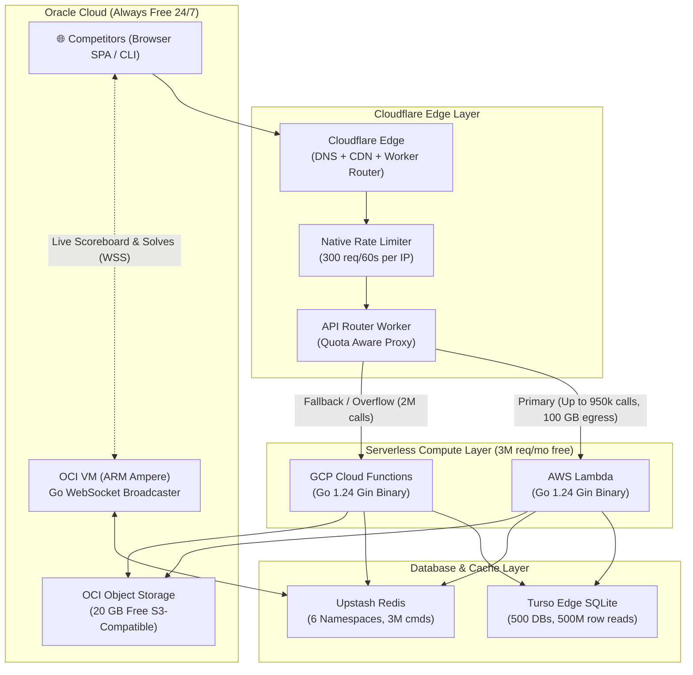

# Building RootAccess: A Zero-Cost, Multi-Cloud Serverless CTF Platform

Hosting Capture The Flag (CTF) competitions presents a notoriously brutal infrastructure challenge. 

Traffic is extremely **bursty**: a platform sits virtually idle for weeks, and then suddenly experiences thousands of concurrent hackers solving challenges, submitting flags, and refreshing the scoreboard during an intense 36-to-48-hour weekend sprint. 

Running dedicated Kubernetes clusters or beefy compute instances year-round for intermittent contests burns hundreds of dollars. On the flip side, naive serverless deployments risk runaway billing or hitting vendor-specific limits — like data egress penalties or function throttling — mid-competition.

To solve this, I designed and built **RootAccess** (`rootaccess.live`): a production-grade, full-stack CTF platform engineered from the ground up to run **100% within always-free cloud tiers**, while comfortably handling **4 to 6 full-scale competitions every month (50+ teams, 300–500 participants per event) without paying a single dollar**.

Here is the deep-dive architecture of how AWS Lambda, Google Cloud Functions, Cloudflare Workers, Oracle Cloud Infrastructure (OCI), Turso DB, and Upstash Redis work together as an interconnected, zero-cost machine.

---

## 1. High-Level Architecture Overview

Instead of locking into a single cloud provider, RootAccess leverages the strongest always-free tier features across four major clouds:



### The Component Breakdown

| Layer | Technology | Free Tier Allocation | Strategic Role |
|---|---|---|---|
| **API Routing** | Cloudflare Workers | 100,000 req/day (~3M/month) | Smart quota tracking, health checks, edge rate-limiting, and backend proxying |
| **Primary Compute** | AWS Lambda | 1,000,000 req/month + 400k GB-sec | Handles primary API traffic with **100 GB free internet egress** |
| **Fallback Compute**| GCP Cloud Functions | 2,000,000 req/month + 400k GB-sec | Overflow reservoir when Lambda quota threshold is approached |
| **Real-time Engine** | OCI Always Free VM | 4 ARM OCPUs, 24 GB RAM, 10 TB egress | Persistent WebSocket broadcaster for live scoreboard & solves |
| **Primary Storage** | Turso (libSQL) | 500 databases, 500M row reads | Edge SQLite; isolated database per CTF event |
| **Distributed Cache**| Upstash Redis | 6 DBs × 500k commands (3M cmds/mo) | Rate limiting, solve locking, team sessions, scoreboard caching |
| **Challenge Files** | OCI Object Storage | 20 GB Always Free | S3-compatible file storage with 7-day presigned URLs |

---

## 2. The Cloudflare Worker: Intelligent Quota-Aware Router

The biggest challenge with multi-cloud serverless is knowing **when to switch backends before you get billed**.

All API requests arrive at `ctfapis.rootaccess.live`. A custom Cloudflare Worker sits in front of AWS and GCP. It reads persistent monthly invocation counters from Cloudflare Workers KV (`ROUTER_KV`).

```javascript
// cloudflare-worker/src/index.js
const LAMBDA_FREE_TIER       = 1_000_000;
const GCF_FREE_TIER          = 2_000_000;
const QUOTA_FRACTION         = 0.95;
const LAMBDA_QUOTA_THRESHOLD = Math.floor(LAMBDA_FREE_TIER * QUOTA_FRACTION); // 950,000
const GCF_QUOTA_THRESHOLD    = Math.floor(GCF_FREE_TIER * QUOTA_FRACTION);    // 1,900,000

export default {
  async fetch(request, env, ctx) {
    const url = new URL(request.url);

    // 1. Edge abuse backstop: rejects floods before touching serverless quota
    if (url.pathname !== "/_router/status") {
      const clientIP = request.headers.get("cf-connecting-ip");
      if (await isRateLimited(env, clientIP)) {
        return new Response(JSON.stringify({ error: "Too many requests" }), { status: 429 });
      }
    }

    const counts = await getCounts(env);
    const useLambda = counts.lambda < LAMBDA_QUOTA_THRESHOLD && !!env.LAMBDA_BASE;

    // ── Primary: AWS Lambda ──────────────────────────────────────────
    if (useLambda) {
      try {
        const res = await proxy(env.LAMBDA_BASE, request.clone(), url, "lambda");
        if (res.status === 429 || res.status >= 500) {
          // Automatic failover on server error or rate limit
          await env.ROUTER_KV.put(COUNTERS.lambda.key, String(LAMBDA_QUOTA_THRESHOLD));
          return await routeToGCF(env, request, url, ctx);
        }
        ctx.waitUntil(increment(env, "lambda"));
        return res;
      } catch (err) {
        return await routeToGCF(env, request, url, ctx);
      }
    }

    // ── Secondary / Fallback: Google Cloud Function ──────────────────
    return await routeToGCF(env, request, url, ctx);
  }
};
```

### The "GCP Egress Trap" & Why Lambda Must Be Primary

A critical lesson learned in production: **Google Cloud Functions offers 2,000,000 invocations for free, but only 1 GiB of free internet egress per month on the Premium network.**

If a CTF serves challenge descriptions, hint data, and JSON payloads across 200,000 requests, returning 20 KB per response burns through 4 GB of egress. On GCP, you would immediately be billed for egress after 1 GB.

**AWS Lambda, however, includes 100 GB of free internet egress per month across all AWS services.**

By setting AWS Lambda as the **primary backend** for the first 950,000 requests, the platform absorbs all heavy initial traffic and JSON egress completely free. GCP Cloud Functions acts strictly as the high-capacity fallback.

---

## 3. Persistent WebSockets on Oracle Cloud (OCI Always Free)

In a CTF, participants spam F5 to see if their rank moved up on the scoreboard. If 500 users poll an HTTP endpoint every 5 seconds, that single scoreboard consumes **360,000 serverless invocations per hour**, which would incinerate the entire monthly free tier in one afternoon.

To solve this, RootAccess completely decouples real-time updates from serverless compute:

1. **Persistent Connection:** The browser connects directly to `wss://ws.rootaccess.live`, which routes to an **OCI Always Free ARM Ampere VM (4 OCPUs, 24 GB RAM, 10 TB free egress)**.
2. **Event-Driven Broadcast:** When a competitor solves a challenge via AWS Lambda, Lambda writes the solve to Turso DB and publishes an event to **Upstash Redis Pub/Sub** (`ws_broadcast`).
3. **Instant Fan-Out:** The Go WebSocket daemon on the OCI VM listens to Redis and instantly broadcasts updated scores and solve banners to all 500+ connected clients in memory.

**Result:** Zero serverless invocations for scoreboard updates, sub-50ms live leaderboard updates, and virtually unlimited free outbound WebSocket traffic via OCI's 10 TB allowance.

---

## 4. Multi-Tenant Database Architecture with Turso

Traditional relational databases on free tiers usually provide one tiny 500MB instance. Turso (libSQL/edge SQLite) completely changes the paradigm:

* **500 Databases on the Free Tier**
* **500 Million Row Reads / Month**
* **5 GB Total Storage**

Because RootAccess can spawn up to 500 independent databases, every contest receives its own dedicated database:
* `ctf-spring-2026.db`
* `ctf-university-round1.db`

This provides **100% data isolation** between competitions. When a contest concludes, the database can be snapshotted or archived without risking cross-event data corruption or complicated table filtering.

---

## 5. Frontend: Angular 21 Workspace Microfrontends

On the client side, RootAccess uses **Angular 21** with **Tailwind CSS v4** and an **Angular Multi-Project Workspace**.

```
frontend/
├── src/                          # Thin Shell (orchestrator + navbar + guards)
└── projects/                     # Domain Packages
    ├── auth-mfe/                 # Login, Register, OAuth, Passwords
    ├── challenges-mfe/           # CTF Challenges, Submissions, Writeups
    ├── contests-mfe/             # Multi-contest isolation & scoping
    ├── social-mfe/               # Scoreboard, Activity, User Profiles
    ├── team-mfe/                 # Team creation, invite codes, leadership
    ├── admin-mfe/                # 9 Admin tabs & platform moderation
    ├── collaborator-mfe/         # Contest manager for external hosts
    ├── shared-services/          # Centralized Auth, WebSocket, Notification singletons
    └── shared-ui/                # Design system components
```

### Why Workspace Monorepo Beats Runtime Module Federation Here

While Module Federation is trendy, it introduces significant downsides for small-to-medium platforms:
1. **Pre-Bootstrap Latency:** Runtime federation requires fetching `remoteEntry.json` manifests over the network before Angular can even bootstrap.
2. **Multi-Pipeline Complexity:** Building 8 separate remotes requires 8 independent CI/CD jobs and CORS configurations.

By utilizing Angular 21's modern **esbuild application builder** (`@angular/build:application`) with native dynamic imports:

```typescript
// app.routes.ts
export const routes: Routes = [
  { 
    path: 'challenges', 
    loadComponent: () => import('@rootaccess/challenges-mfe').then(m => m.ChallengeListComponent),
    canActivate: [authGuard] 
  },
  { 
    path: 'contests', 
    loadComponent: () => import('@rootaccess/contests-mfe').then(m => m.ContestsComponent),
    canActivate: [authGuard] 
  }
];
```

The compiler automatically splits every domain into separate, heavily optimized JavaScript chunks (`chunk-YR2FQQZ4.js`). Users only download the admin panel or contest tools when they actually navigate there, achieving sub-second initial page loads on a single static hosting pipeline.

---

## 6. Monthly Capacity Planning: How Many CTFs for Free?

For a standard contest featuring **~50 teams (300 to 500 participants)** running over 24 to 48 hours:

| Resource Metric | Per-Contest Usage | Combined Free Allowance | Utilization |
|---|---|---|---|
| **Dynamic API Calls** | 60,000 – 90,000 | 3,000,000 (Lambda + GCF) | ~2.5% |
| **Peak Day Requests** | 40,000 – 60,000 | 100,000 / day (Cloudflare) | ~50% |
| **Redis Commands** | 120,000 – 180,000 | 3,000,000 (6 Upstash DBs) | ~5% |
| **Turso DB Reads** | ~1,000,000 rows | 500,000,000 rows | < 0.2% |
| **WebSocket Egress** | ~2 GB | 10,000 GB (OCI VM) | 0.02% |

### The Golden Scheduling Rule
Because Cloudflare Workers enforces a **100,000 daily request limit**, two 500-player CTFs cannot run on the exact same Saturday. However, by running contests across separate days or weekends:

* **Recommended Cadence:** **4 to 6 weekend CTFs per month** (1 per weekend, using 1 dedicated Upstash Redis DB per event).
* **Maximum Theoretical Capacity:** **Up to 12 CTFs per month** on non-overlapping days, entirely within free tier limits.

---

## 7. Key Takeaways

1. **Don't fight serverless limits — redirect them:** Offloading persistent WebSockets to an Always-Free OCI VM eliminated 90% of potential serverless invocation costs.
2. **Watch the egress footnotes:** Always check outbound networking limits. AWS Lambda's 100 GB egress paired with Cloudflare caching prevented GCP's 1 GiB limit from creating surprise bills.
3. **Keep architecture simple until forced:** Domain-driven Angular workspaces with route-level chunk splitting give you all the code decoupling of microfrontends without the operational nightmare of runtime federation.

Building high-performance software doesn't require high-tier cloud budgets. With the right routing, caching, and multi-cloud composition, you can build enterprise-grade platforms that cost $0.00 to run.
