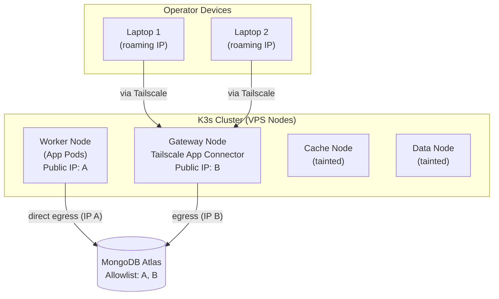
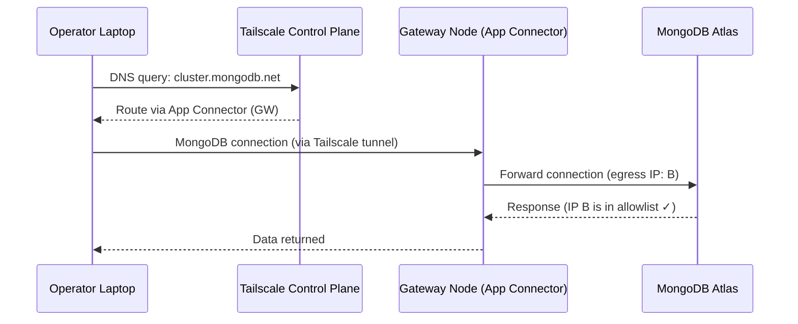

# Locking Down MongoDB Atlas: Tailscale App Connectors for Roaming Clients

I run a small K3s cluster spread across a handful of VPS nodes, plus a MongoDB Atlas cluster that several backend services talk to. At some point, Atlas's Network Access list had drifted to `0.0.0.0/0` — anyone on the internet with valid credentials could attempt a connection. Not catastrophic on its own (auth is still required), but it's an unnecessary attack surface: it means the only thing standing between the internet and our data is a password, with no network-layer boundary at all.

The fix should have been simple: whitelist the IPs that actually need access, remove the open rule. In practice it took a few detours worth writing down, because two very different kinds of clients needed to reach the same database:

1. **Production app pods**, running on a single dedicated worker node with a static public IP.
2. **A couple of operator laptops**, used for debugging via `mongosh`/Compass, with IPs that roam constantly (home Wi-Fi, mobile hotspots, coffee shops).

Atlas's IP Access List only understands static IPs or CIDR ranges. That works great for #1. It's actively hostile to #2 — you can't whitelist an IP that changes every time someone reconnects to Wi-Fi.

## The Existing Network Layout

The cluster already had a private WireGuard mesh (`10.0.0.0/24`) tying the VPS nodes together — internal traffic like the Kubernetes API, the database backing K3s's own state, Redis, and internal service-to-service calls all ride over that mesh, encrypted node-to-node.

It's a clean setup, but it's worth being precise about what it does and doesn't cover: **WireGuard here only routes traffic between the VPS nodes themselves.** It has nothing to do with how those nodes reach the public internet — outbound traffic to something like Atlas never touches the WireGuard interface at all, since `10.0.0.0/24` isn't a route any external host would recognize. Egress to the internet just goes out each node's normal public IP.

That distinction mattered a lot for scoping this fix. Digging into the cluster's scheduling config, it turned out only *one* node in the cluster actually runs application workloads — the others are dedicated to gateway duties, a cache layer, and data services, all tainted against running general pods. So of four VPS nodes, exactly one node's public IP was the real egress path for production Mongo traffic. The other three were never in the picture.



## Solving the Roaming-Laptop Problem: Tailscale App Connectors

For the two personal devices, we needed something that didn't depend on a static IP. The pattern that fits here — and is actually a documented Tailscale use case for exactly this Atlas scenario — is an **App Connector**:

- One always-on device (we picked our gateway node, kept deliberately separate from the node running production workloads) joins the tailnet and advertises itself as a connector for a specific domain — in our case, the Atlas cluster's hostname pattern.
- That connector's *public* egress IP gets whitelisted in Atlas — once, and it never changes.
- Any other device on the tailnet, once granted access, has its DNS queries for the target domain silently intercepted by Tailscale. The resolved destination IP gets dynamically routed through the connector instead of the device's own internet connection.
- The client sees zero difference — same connection string, same tooling, no code changes. Atlas just sees one static IP no matter which laptop, network, or country the query actually came from.



## Gotchas We Hit Along the Way

None of this "just worked" on the first try, and each snag is worth calling out because they're easy to miss.

### 1. Tags need to be pre-declared

Tailscale's ACL policy uses a `grants`-based model now. Before you can apply a tag like `tag:atlas-connector` to a device, that tag has to exist in the policy's `tagOwners` block — otherwise `tailscale up --advertise-tags=...` just fails with a generic "invalid or not permitted" error. A two-line addition to the policy fixed it:

```json
"tagOwners": {
  "tag:atlas-connector": ["autogroup:admin"]
}
```

### 2. IP forwarding is off by default

Any device acting as a subnet router or App Connector needs OS-level IP forwarding enabled. Ubuntu doesn't ship with this on, and Tailscale doesn't hard-fail when you bring the connector up without it — it just quietly warns during `tailscale up`, and later the admin console flags the connector as "not configured properly."

```bash
# Enable IP forwarding permanently
echo 'net.ipv4.ip_forward=1' | sudo tee -a /etc/sysctl.d/99-tailscale.conf
echo 'net.ipv6.conf.all.forwarding=1' | sudo tee -a /etc/sysctl.d/99-tailscale.conf
sudo sysctl -p /etc/sysctl.d/99-tailscale.conf
```

Then bring up the connector:

```bash
sudo tailscale up \
  --advertise-tags=tag:atlas-connector \
  --app-connector
```

### 3. Discovered routes need manual approval

App Connectors don't get a blanket "route everything for this domain" grant automatically. Instead, as client devices actually query the target domain, Tailscale's control plane discovers the specific destination IPs one at a time and stages them as pending routes — which an admin has to approve in the console before they actually take effect for other devices.

For a 3-node replica set (as most Atlas clusters are), that meant watching for and approving **three separate `/32` routes**, not just one. If you only test with one query and call it done, two-thirds of your replica set traffic will silently keep going out the old, unrouted path.

### 4. Test with something Atlas-independent

Since network-layer blocking happens before authentication, a plain TCP connection attempt (no credentials needed) is enough to tell you whether a given path is actually allowed — much faster than debugging through driver-level connection errors:

```bash
# Quick TCP reachability test — no credentials needed
nc -zv your-cluster.mongodb.net 27017

# Or with timeout
timeout 5 bash -c 'cat < /dev/null > /dev/tcp/your-cluster.mongodb.net/27017' \
  && echo "TCP: reachable" || echo "TCP: blocked"
```

## Did It Add Latency?

This was the one thing worth measuring rather than assuming. Routing personal-device traffic through an extra hop (laptop → connector → Atlas) instead of a direct path could plausibly add real latency, especially if that connector node lived on a different continent from either party.

We measured it directly:

| Path | Latency |
| --- | --- |
| Laptop → connector node (direct internet) | ~35 ms |
| Laptop → connector node (via Tailscale) | ~40 ms |
| Connector node → Atlas | ~4 ms |
| **Laptop → connector → Atlas (actual new path)** | **~45 ms** |
| Laptop → Atlas (old direct path) | ~47 ms |

Turned out to be a wash — in our case the connector node happened to sit geographically close to both the operator and the database region, so the detour added only a few milliseconds, indistinguishable from normal network jitter.

That's very setup-specific though: if your connector and your database are on opposite sides of the planet, budget for real added latency and place the connector node accordingly.

## End State

- **Atlas Network Access**: exactly two static IPs whitelisted — the one worker node that actually runs application pods, and the one gateway node running the Tailscale App Connector.
- `0.0.0.0/0` removed.
- Two operator laptops connect exactly as before (same connection strings, same tools), transparently routed through the connector, with no IP of their own ever touching the Atlas allowlist.
- Zero code or app-level changes required — this was entirely a network-layer fix.

The overall lesson: "just whitelist the IPs" is the right instinct, but it breaks down the moment any of your legitimate clients don't have a stable IP. An App Connector turns "whitelist this laptop" into "whitelist this one dedicated box, once," which is both more secure and considerably less annoying to maintain.
