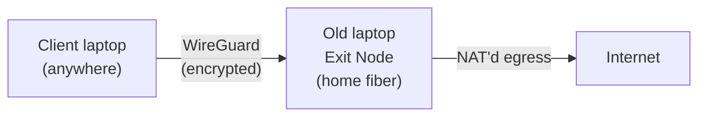

# Turning an Old Laptop Into a Permanent Exit Node with Tailscale

I have an old laptop sitting headless at home, permanently connected to my fiber
line. Rather than let it collect dust, I turned it into a **Tailscale exit node** —
a way to route traffic from any of my other devices, anywhere, back out through my
home connection. This is the kind of thing that's useful when a service only trusts
requests from a "known" residential IP, or when you're on an untrusted network and
want your traffic to look like it's coming from home instead.

This post walks through the setup end to end: the client/exit-node split, the ACL
policy that keeps it locked down to my own devices, and a routing issue I hit along
the way that's worth knowing about if you try this yourself.

---

## The Setup

Two machines, two roles:

- **Exit node** — the old laptop, headless, always on, sitting on the home fiber
  connection.
- **Client** — my daily-driver laptop, which routes its outbound traffic through
  the exit node whenever I want to appear as if I'm on the home network.

Both are just peers on the same [tailnet](https://tailscale.com/kb/1136/tailnet)
(Tailscale's term for your private WireGuard mesh) — no port forwarding, no public
IP required, no messing with the router.



---

## 1. Enable IP Forwarding on the Exit Node

The exit node needs to forward packets between the tailnet and the wider internet,
which means enabling kernel-level IP forwarding:

```bash
echo 'net.ipv4.ip_forward = 1' | sudo tee -a /etc/sysctl.d/99-tailscale.conf
echo 'net.ipv6.conf.all.forwarding = 1' | sudo tee -a /etc/sysctl.d/99-tailscale.conf
sudo sysctl -p /etc/sysctl.d/99-tailscale.conf
```

> **Common mistake:** it's easy to run this on the wrong machine. This goes on the
> box that will *be* the exit node — not on the client that will be *using* it. If
> you enable forwarding on the client by accident, it's harmless, just unnecessary,
> and you can safely `sudo rm /etc/sysctl.d/99-tailscale.conf` to clean it up.

## 2. Advertise the Exit Node

```bash
sudo tailscale up --advertise-exit-node
sudo systemctl enable --now tailscaled
```

`systemctl enable` matters here — it makes sure `tailscaled` (and therefore the
exit-node advertisement) survives a reboot without you having to SSH back in and
re-run anything.

## 3. Approve It

By default, Tailscale won't let *any* device use a peer as an exit node just
because it's advertising — you have to explicitly approve it, either in the admin
console (**Machines → [device] → Edit route settings → Use as exit node**) or via
an ACL rule (more on that below).

## 4. Use It From a Client

```bash
sudo tailscale up --exit-node=<exit-node-tailscale-ip> --accept-routes --ssh
```

`tailscale status` on the client should now show the exit node as `active`:

```
100.x.x.x   exit-node-hostname   user@   linux    active; exit node; direct 192.168.x.x:41641
```

The `direct` marker is worth noting — it means Tailscale negotiated a peer-to-peer
WireGuard connection instead of relaying through Tailscale's DERP servers, which
gives you close to native latency.

A quick sanity check that it's actually working:

```bash
curl -4 ifconfig.me
```

This should return the exit node's public IP instead of whatever network the
client is actually sitting on. (If both machines happen to share the same home
network at the time of testing, this check is misleading — you'll get the same IP
either way, exit node or not. The real test is trying it from a genuinely
different network, like mobile data.)

---

## Locking It Down with ACLs

Tailscale's default access policy is "all devices can reach all devices, on all
ports" — fine to get started, but worth tightening once you've got a permanent
exit node and Tailscale SSH in the mix. My tailnet is small (just my own devices),
so the goal wasn't a complex multi-user policy — just closing a couple of obvious
gaps:

```json
{
  "tagOwners": {
    "tag:exit-node": ["autogroup:admin"]
  },

  "grants": [
    { "src": ["autogroup:member"], "dst": ["autogroup:member"], "ip": ["*"] }
  ],

  "ssh": [
    {
      "action": "check",
      "src": ["autogroup:member"],
      "dst": ["autogroup:self"],
      "users": ["autogroup:nonroot", "root"]
    }
  ],

  "autoApprovers": {
    "exitNode": ["tag:exit-node"]
  }
}
```

A few things worth calling out:

- **`autoApprovers.exitNode` takes a tag, user, or group — not a device IP.** My
  first attempt was to drop the exit node's Tailscale IP straight into that field,
  which fails with a fairly clear error. The fix is to tag the device instead:

  ```bash
  sudo tailscale up --advertise-exit-node --advertise-tags=tag:exit-node
  ```

  and reference `tag:exit-node` in `autoApprovers`. Now if the exit node ever
  re-advertises (reboot, reinstall, whatever), it's auto-approved instead of
  sitting there waiting for a manual click in the console.

- **`"action": "check"` for SSH**, rather than `"accept"`. This is Tailscale's own
  default and it's a sensible one — it still requires periodic re-authentication
  for SSH sessions rather than granting blanket passwordless access forever, even
  between your own trusted devices.

---

## The Routing Problem

After tightening the ACLs, I hit an issue: enabling the exit node from the client
killed its internet connection outright. Worth documenting the debugging path,
since "exit node enabled, internet dead" is a common enough failure mode.

**First suspect: the firewall.** `ufw`'s default forwarding policy is `DROP`, and
that's a well-known way to silently break exit-node forwarding even when
`ip_forward` is correctly enabled at the kernel level. Checked it:

```bash
sudo ufw status
# Status: inactive
```

Not it, in this case. Next, checked the actual forwarding chain:

```bash
sudo iptables -L FORWARD -v -n
```

```
Chain FORWARD (policy ACCEPT 2 packets, 304 bytes)
 pkts bytes target     prot opt in     out     source          destination
    0     0 ts-forward  0    --  *      *      0.0.0.0/0        0.0.0.0/0
```

Policy was `ACCEPT` and Tailscale's own `ts-forward` chain was present — but it had
seen **zero packets**. That's the useful signal: traffic wasn't even reaching the
exit node to be forwarded, which points further upstream than the firewall —
likely either a stale route/approval state after the tag change, or a DNS
resolution issue on the client masquerading as a total connectivity loss.

The standard way to split those two possibilities apart:

```bash
# raw connectivity, bypasses DNS entirely
ping -c 3 1.1.1.1

# DNS specifically
ping -c 3 google.com
```

If the IP ping works but the DNS-based one doesn't, it's a DNS problem (usually
fixed by checking what DNS server `--accept-routes` handed the client, or
disabling MagicDNS override temporarily to compare). If even the raw IP ping
fails, it's routing — worth checking the NAT/masquerade rule on the exit node:

```bash
sudo iptables -t nat -L -v -n
```

This is where I left off — a useful reminder that "it should just work" VPN
tooling still has real plumbing underneath, and a single stale approval or ACL
tag change can leave that plumbing in a half-updated state until you dig in with
`iptables` and `ping` to find where the packet actually stops.

---

## Takeaways

- Exit-node setup itself is two commands (`--advertise-exit-node` on the exit
  node, `--exit-node=<ip>` on the client) — the complexity is almost entirely in
  approval flow and ACLs, not the networking itself.
- `autoApprovers` for a tagged device is worth setting up immediately if the exit
  node is meant to be permanent — otherwise a reboot or reinstall means walking
  back to the admin console to click approve again.
- When exit-node traffic silently dies, check firewall policy first (`ufw`,
  `iptables -L FORWARD`), then split DNS from raw routing with `ping <ip>` vs.
  `ping <hostname>` before going further down the NAT/masquerade rabbit hole.
- Enabling Tailscale SSH (`--ssh`) is a separate, tailnet-wide capability worth
  being deliberate about — it's governed by your ACL's `ssh` block, not your local
  `sshd`, and defaults to allowing any tailnet member unless you scope it down.
